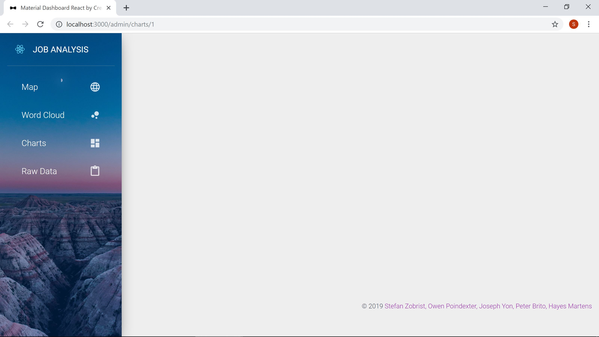
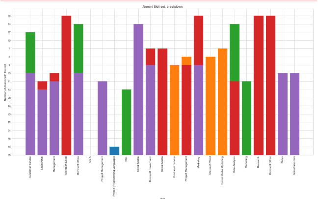
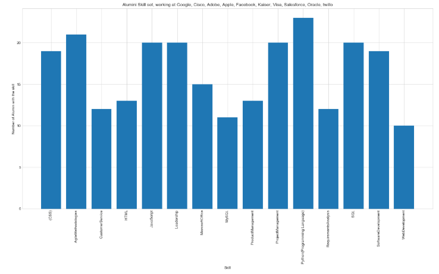

# Web-Scraping-JobMarket-Analytics--LinkedIn

# Background

Extract Analyst Job and Profile description from Job-Listing web-site such as Indeed, Google and LinkedIn. 

# Goals

The Goal was uncover trends and gaps on Job market to help candidates be more competitive against resume-scan software. Next phase is train a model on our data and create an online application.
#### Phase 1
* Extract data
* Transform
* Load

#### Phase 2
* Perform Analytics
* Create Visualizations
* Display findings in a Dashboard

# What I have done in this project

It was a 2 weeks Project.

#### 40% time consulmed

* Extracted "Analyst-Profile data from Google Search" using BeautifulSoap library to scrap the pages and Splinter to build the Bot.

* Extracted "Analyst-Job data from LinkedIn" as well using BeautifulSoap library to scrap the pages and Splinter to build the Bot.

* Created features to make the bot operate under the radar and do not get blocked.
#

#### 30% time consulmed
* Transformed the data using Pandas and Numpy, performing the cleaning and formatting.

* Creating Functions to make all functions interact  the all process automatic.

* Created data pipeline, to ensure the data that the script extract has all properties necessaries. 

#

#### 15% time consulmed
* First attempt into store into Csv file and PgnSQL database, but it didnt work well, because of the properties  of raw data.
* Load into MongoDB Database in the Json format, because of high volume of rows for each record.

#

#### 15% time consulmed
* Analysis, I narrow the research into a niche, only "UC Berkeley Extension Alumni"
* Performed Analytics to uncover trends such as Top Skills and Companies.
* Created Visualizations using Matplotlib.

#### Now, in progress..

* Creating a API, with all the data
* Creating Data aplication pipeline
* Creating a Machine Learning Model with "NLP" Algorithm

# Alumni Visualization

# How to run

# Dashboard

# Presentation

