# Web-Scraping-JobMarket-Analytics--LinkedIn

# Background

Extract Data from Job-Listing such Indeed, Google, mainly from LinkedIn. 

# Goals

The Goal was uncover trends and gaps on Job market to help candidates be more competitive against resume-scan software. Next phase is train a model on our data and create a online aplication.

* Extract data
* Transform
* Load

* Perform Analytics
* Create Visializations
* Dysplay findings in a Dashboard

# What I have done in this project

* Extracted  Analyst-Profile data from Google
* Extracted  Analyst-Job data from LinkedIn

# Presentation

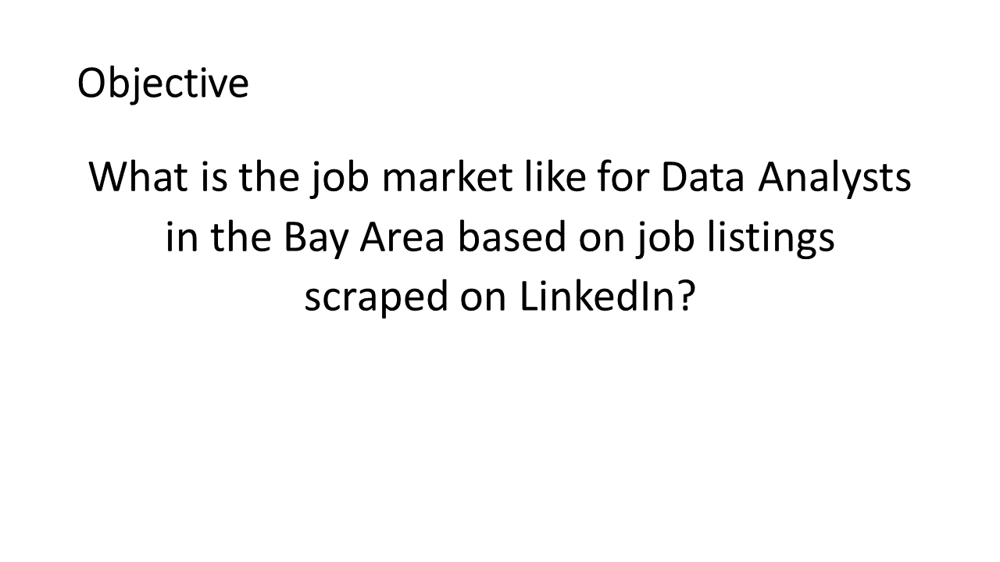

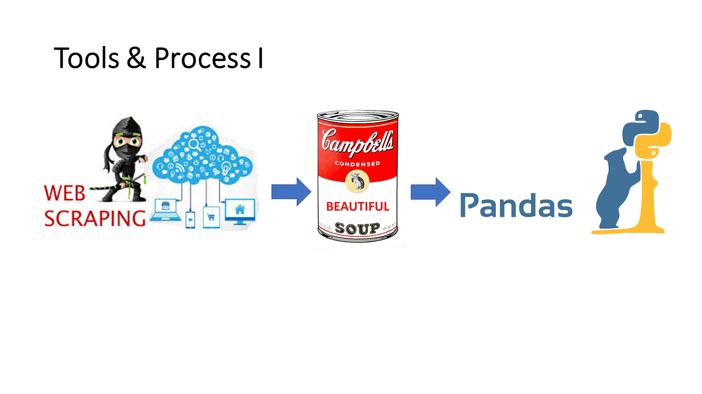

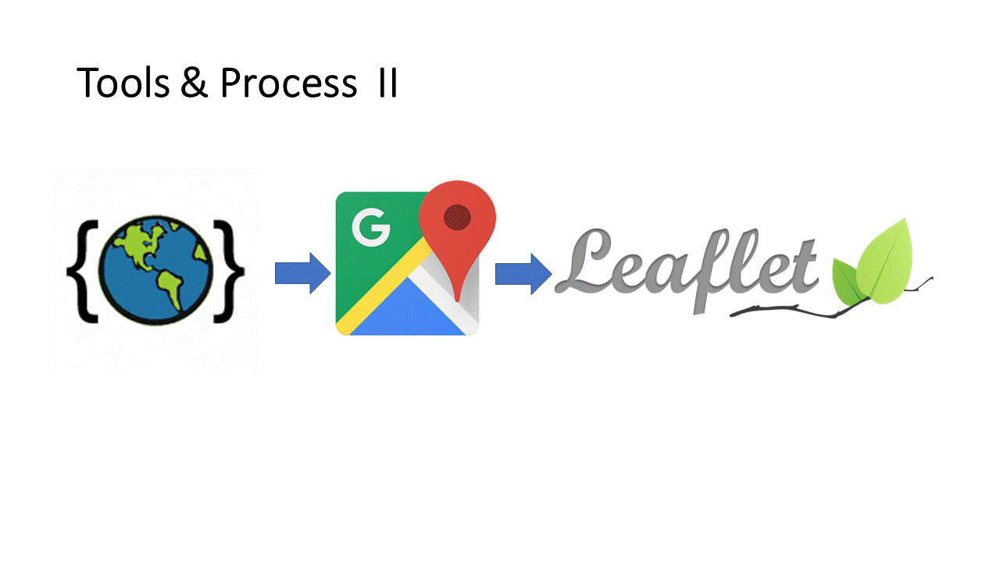

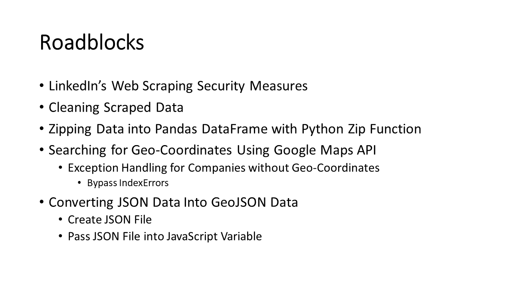

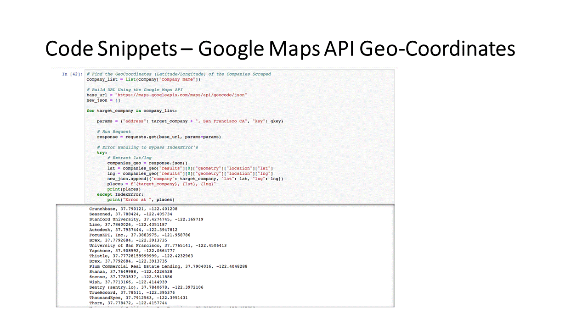

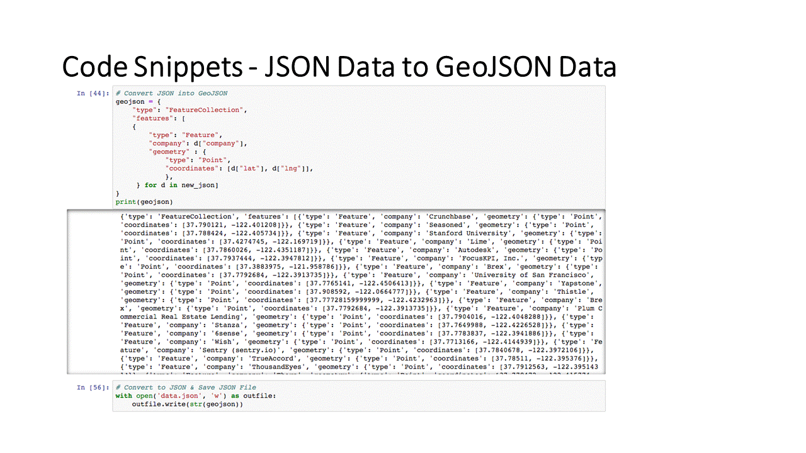

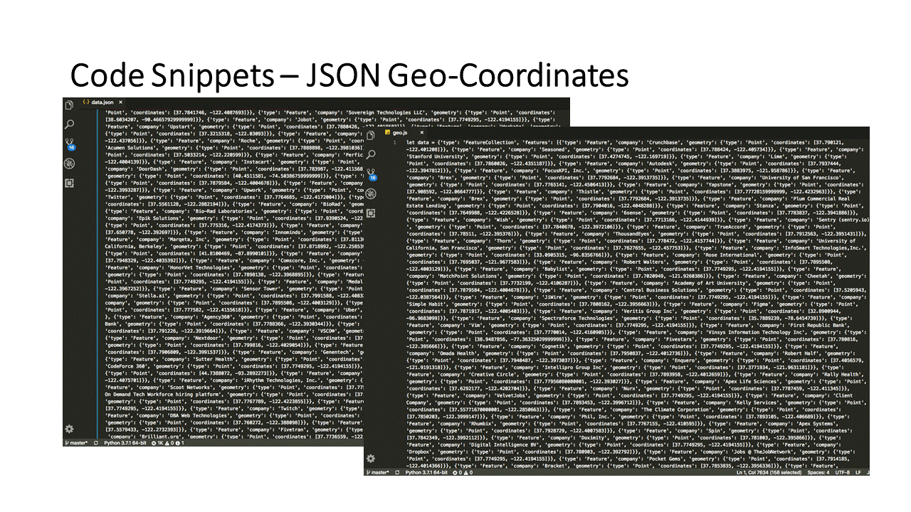

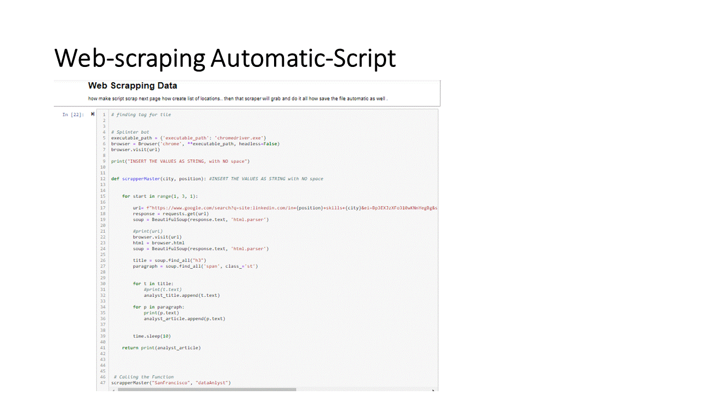

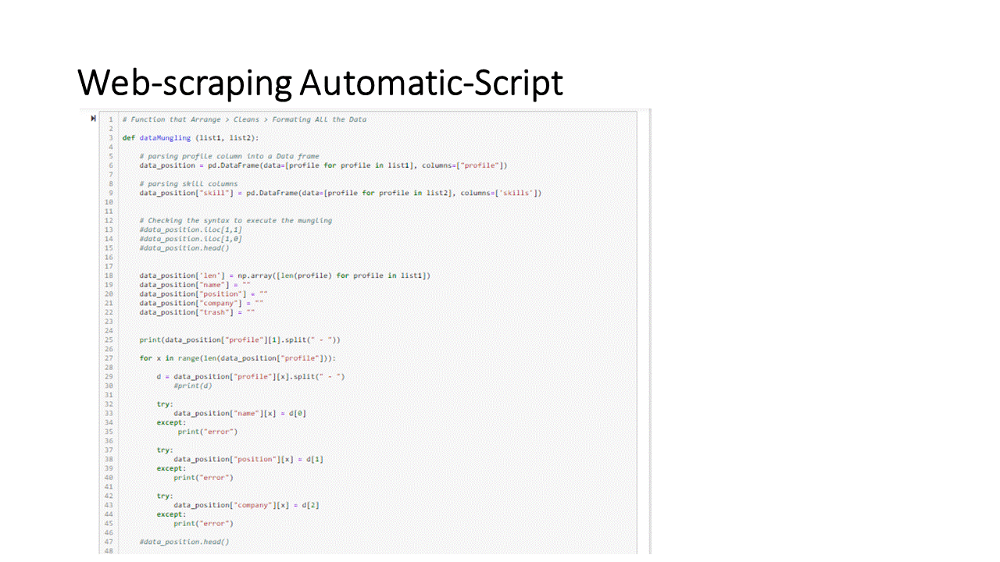

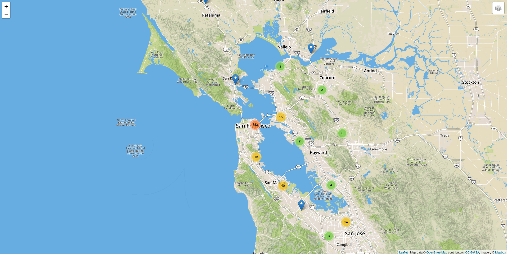

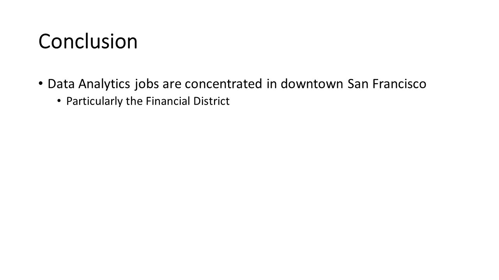

